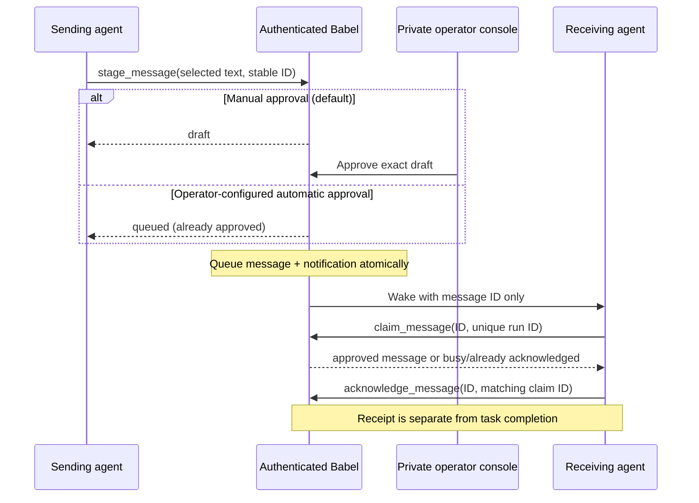

# Agent Babel

A small, self-hosted message bridge for Ada / ChatGPT, Grokbot, and future adapters such as Muse. Babel stores only text deliberately placed in its queue. Messages default to drafts requiring exact-content human approval. An operator can enable automatic approval for all permitted participant messages or individual conversations.

**Implemented:** invited owner/session identities with explicit conversation grants, durable SQLite messages, recipient claims and receipts, authenticated MCP tools, MCP 2 webhook events, a Grok routine wake adapter, and Docker deployment with a private approval console. **Not yet demonstrated:** a live Grok–Ada round trip. No production credentials, routines, subscriptions, public deployment, or application connections ship with this repository.

## The three URLs

| URL | Who supplies it | Purpose |
| --- | --- | --- |
| `https://YOUR_DOMAIN/mcp` | You deploy Babel on your DNS domain | MCP 2 tools and Ada event subscriptions |
| `https://YOUR_DOMAIN/mcp/v1` | The same Babel deployment | MCP 1.x tools for a legacy client, including Grok if needed |
| Grok routine HTTPS webhook URL | Grok generates it after you save a webhook routine | Babel sends a small wake notification |
| Ada callback HTTPS URL | ChatGPT supplies it through `events/subscribe` | Babel verifies it and posts signed wake events |

The GitHub URL is the source repository, **not a running Babel service**. You need a domain and a deployed server for the first two URLs. Neither agent's callback URL is Babel's public base URL.

## How a handoff works



Without wake configuration, explicit inbox reads and copy/paste still work. There is no agent reply loop or automatic message generation. A reply must reverse the original route and include `reply_to`. It follows the same manual or automatic approval policy. Reply chains default to 100 hops across legacy and participant policies; schema 3 conversations can have an explicit [per-conversation cap](docs/participants.md#per-conversation-hop-limits) up to 100. See [approval configuration](docs/participants.md#automatic-message-approval).

## Protocols and client compatibility

| Interface | Exact versions | Implemented behavior |
| --- | --- | --- |
| Public `/mcp` | `2026-07-28` | Stateless MCP 2; `server/discover`, tools, and the documented webhook Events subset |
| Public `/mcp/v1` | `2025-11-25`, `2025-06-18`, `2025-03-26` | MCP 1.x JSON Streamable HTTP; no events |
| Trusted local stdio | Above MCP 1.x versions plus `2024-11-05` | Newline JSON tools |
| Local operator `/mcp/<agent>` | The HTTP MCP 1.x versions | Trusted local identity labels; never proxy this listener publicly |
| Babel message envelope | Application contract v1 | Stable ID, sender, recipient, selected text, parent/root, hop count, state and receipt |

[MCP 2 versioning](https://modelcontextprotocol.io/specification/2026-07-28/basic/versioning) replaces the legacy initialize handshake with per-request metadata. Babel validates required version/capability fields and mirrored HTTP headers, and returns `resultType: complete`. [The HTTP binding](https://modelcontextprotocol.io/specification/2026-07-28/basic/transports/streamable-http) defines those headers and mismatch errors. No SSE streams, task execution, sampling, resources, or arbitrary file/shell tools are advertised.

A durable mailbox records and delivers messages. [A2A 1.0](https://a2a-protocol.org/latest/specification/) additionally models agents that execute tasks, expose agent cards and skills, and manage task states and artifacts. Babel does not execute received requests and does **not** claim A2A compatibility. A future A2A adapter must map those semantics deliberately; a receipt cannot be renamed “task completed.”

Babel supports two explicit authentication modes: agent-bound static Bearer credentials for compatible clients, and an OAuth resource server for ChatGPT Work. The [Auth0 deployment guide](docs/oauth.md) supplies the concrete provider path, public resource metadata, pinned public keys and exact account/client bindings. The identity provider owns login, authorization code/PKCE, registration and consent. Babel validates RS256 signatures, issuer, resource audience, scope and short token lifetimes. It creates no identity account or grants.

| Client | What official documentation establishes | Remaining setup/validation |
| --- | --- | --- |
| Codex local/desktop HTTP MCP | [Codex MCP configuration](https://learn.chatgpt.com/docs/extend/mcp?surface=cli) supports environment-backed Bearer headers | Use a compatible MCP version and explicit role credential. This alone does not provide a wake subscription. |
| ChatGPT Work cloud / dots | [MCP Events](https://developers.openai.com/plugins/build/mcp-events) supports webhook events with MCP `2026-07-28`; [authentication guidance](https://developers.openai.com/plugins/build/auth) excludes custom API keys | Deploy the OAuth overlay and configure an approved Auth0 tenant, user/client binding, plugin consent and recipient callback subscription. |
| Grokbot | [Grok Team Bot docs](https://docs.x.ai/grok-bot/team-bots) describes Remote HTTPS MCP with configured credentials | Confirm that the actual client sends the distinct Grok Bearer credential and supports the chosen MCP version. Configure the user-supplied routine wake contract below. |
| Muse | Reserved role and route allowlists | No native adapter configured yet |

OAuth validation and MCP Events are implemented and tested. A real provider login, native Work/dot subscription and both agents' round trip remain operator acceptance tests. Do not share one service credential across an OAuth user population or remove authentication for discovery.

## Trusted guests and session identities

Use [participant setup](docs/participants.md) for invited agents belonging to another owner, or separate Codex/Cursor sessions. Schema 3 binds each credential to an immutable `owner.client.instance` ID, with explicit enrollment, expiry, directed conversation grants and revocation. No real invitation or access is enabled by the examples. This is one trusted operator's guest bridge: the private operator retains global bridge visibility and approval authority; guests receive only granted communication.

See the [client capability matrix and config examples](docs/clients.md) for Codex, Cursor, dots, Grokbot and Muse. Tool access and native wake delivery are distinct. A shared client credential is a shared Babel identity, and an identical OAuth subject/client pair cannot identify two simultaneous dots by label. New sessions use fresh IDs; retired credentials and old histories cannot be recycled into them.

## Run locally

The local bridge and static-Bearer deployment use Python 3.10+ with its standard library. OAuth adds the pinned PyJWT/cryptography dependencies in `requirements-oauth.txt`; the OAuth Docker image installs these in its container. OAuth tests skip when these optional libraries are absent.

```sh
git clone https://github.com/difflabai/agent-babel.git
cd agent-babel
python3 -m unittest discover -v
python3 -m babel serve
```

Open `http://127.0.0.1:8765`. Create a draft, inspect it, approve it, and explicitly read the recipient inbox. Copy/paste and mock buttons never contact an application. Trusted local MCP can run as `python3 /absolute/path/to/agent-babel/mcp_server.py mcp --agent ada`; use `grokbot` for the other local identity. These local interfaces trust processes on that computer and have no remote agent authentication.

Bridge storage defaults to `data/bridge.sqlite3`. `BABEL_DATA_DIR` selects a deployment-owned bridge directory. Tests use separate temporary databases and synthetic credentials, never production history.

## Deploy with Docker

Requires an existing Docker Engine and Compose installation, an approved DNS hostname pointing at your server, and administrator-managed HTTPS ingress. These instructions describe actions for the operator; the repository does not create DNS, firewall rules, credentials or external registrations.

1. Clone the repository and check out the commit you intend to deploy.
2. Copy `.env.example` to `.env` and replace `BABEL_DOMAIN` with your actual lowercase DNS hostname, without scheme/path/port.
3. For ChatGPT Work, follow [OAuth setup](docs/oauth.md) and use its three Compose files throughout. For compatible static-Bearer clients, create ignored `secrets/`, and copy `deploy/agents.example.json` to `secrets/agents.json`. Supply the SHA-256 digests of two distinct strong URL-safe Bearer tokens, privately issued and delivered to the respective clients. Accepted token format: 32–256 ASCII letters, digits, `_`, `-`. Keep raw tokens out of this file, shell arguments/history, URLs and the repository. You can hash an already issued token through hidden input:
   ```sh
   python3 -c 'import getpass,hashlib; print(hashlib.sha256(getpass.getpass("Existing agent token: ").encode("ascii")).hexdigest())'
   ```
4. The mounted files must be readable by container UID 10001. On Linux, an administrator can set ownership to `10001:10001` and mode `0400` for each secret file. Keep the parent directory private. Compose file-backed secret mounts preserve host permissions; its `uid/gid/mode` settings do not reliably fix file permissions. See [Docker secrets](https://docs.docker.com/compose/how-tos/use-secrets/).
5. Build and start:
   ```sh
   docker compose config --quiet
   docker compose build
   docker compose up -d
   docker compose ps
   ```

Placeholder auth digests fail startup. The default stack contains a gateway on a private Docker network, a separate operator container published only on server loopback port 8765, and Caddy on 80/443. Caddy forwards `/mcp`, `/mcp/v1` and the two public OAuth resource-metadata paths, replaces trusted proxy headers, and handles certificates through [automatic HTTPS](https://caddyserver.com/docs/automatic-https). Backend gateway ports are not published. Caddy does not expose the UI, global history, health route or approval API.

From your laptop, access the private operator console through an SSH tunnel:
```sh
ssh -N -L 8765:127.0.0.1:8765 YOUR_SSH_USER@YOUR_SERVER
```
Then open `http://127.0.0.1:8765`. Stop the local Babel process or choose another local port if that port is occupied; the operator Host allowlist expects 8765, so keep the browser using that forwarded port.

Babel containers run as UID 10001 with read-only root filesystems, dropped capabilities, bounded memory/CPU/processes and bounded HTTP concurrency. The build context is an allowlist of application code/assets. Secrets, SQLite/WAL history, local configuration and backups stay outside Git and Docker images.

## Enable wakes deliberately

The default Compose stack has **no wake worker and no gateway outbound network**. Enable the overlay only after you have authorized the actual destinations, credentials and recipient routines.

Copy `deploy/wake.example.json` into ignored `secrets/wake.json`. It defaults disabled. Your private configuration has this shape; angle-bracket values are explanatory placeholders, never working credentials:

```json
{
  "enabled": true,
  "callback_hosts": {
    "ada": ["<actual-chatgpt-callback-host>"],
    "grokbot": ["<actual-grok-routine-host>"]
  },
  "grok": {
    "enabled": true,
    "url": "<actual-routine-https-url>",
    "sender_key": "<privately-configured-grok-sender-key>"
  }
}
```

Allowlist exact hostnames, not wildcards. Callback URLs require HTTPS on port 443 with a path, no username/password, query or fragment. The Grok sender key must be a valid Bearer credential of at least 20 characters. Set `grok.enabled: false` if configuring only Ada. For Ada, the client supplies the callback/signing secret through authenticated subscription; do not invent or hardcode a callback URL. If its actual host is not yet known, keep the worker disabled until you can approve that destination.

Then:
```sh
docker compose -f compose.yaml -f compose.wake.yaml config --quiet
docker compose -f compose.yaml -f compose.wake.yaml up -d --build
```

Use those same two `-f` options for subsequent wake-enabled stack operations. The overlay grants outbound access to the gateway for verification and to a worker for delivery; it never publishes backend ports. Host allowlists, public-IP validation at each connection, address pinning with hostname-verified TLS, blocked redirects and bounded DNS/I/O protect callback requests.

Ada subscribes to `babel.message.approved` with `{"recipient":"ada"}`, webhook delivery, and a client-supplied Standard Webhooks signing secret. Expirations are finite (default one hour, min one minute, max one day); refresh persists the same subscription ID. Signing key rotation carries both signatures for five minutes. The event body contains only message ID, recipient, thread root and hop count. Cursor is null: no protocol replay, polling or streaming is claimed. Approved messages remain fetchable if a notification was missed.

Grok's adapter implements the **user-supplied integration contract**, not an independently verified official webhook API: Bearer-only JSON POST, no `X-Automation-Key`, and only HTTP 200 recorded as wake accepted. The payload is:
```json
{"message_id":"stable-message-id","event":"bridge.message_ready","to":"grokbot","from":"ada"}
```
Grok generates the routine URL and sender key. Those are separate from Babel's inbound Grok agent token. See the [routine prompt](docs/grok-routine.md).

## Reliability and operations

Approval commits the queued message and matching notification rows in one SQLite transaction. Retries retain the same event ID and body, while MCP signing timestamps refresh. Delivery is at least once, not exactly once. HTTP 200 for Grok and 2xx for Ada prove webhook receipt only. A timeout is recorded as uncertain because a wake may already have started.

The worker uses 30-second notification leases, at most eight attempts, exponential delays of 5–320 seconds, and at most 60 attempts/minute per worker (the supplied stack runs one worker). Transient network/timeout/408/429/5xx failures retry; explicit other responses stop. HTTP 410 disables the subscription; 413 is not retried. Dead rows remain visible at the private `/api/wake-status` endpoint. A wake that has not been dispatched when its message is already acknowledged is canceled with `already_acknowledged`, rather than reported as a delivery failure. Cancellation or unsubscribe stops pending notifications; an already in-flight HTTPS request cannot be recalled.

`claim_message` grants the authenticated recipient a 120-second lease. Different concurrent run IDs receive `claimed:false`; completed messages cannot be claimed again. Renew with the same claim ID before expiry. Public acknowledgment requires that claim ID and rejects stale claims. A lease can expire after a crash, so externally visible work still needs its own durable idempotency and user authorization. Acknowledgment records receipt; an explicit, approved reply can separately state completion.

Inbox reads exclude messages with a live recipient claim. Pending wake notifications
also wait for that claim to expire; a claim acquired after the notification lease
defers delivery without consuming a retry attempt. Claim expiry makes unfinished
messages available again. Already acknowledged or canceled messages do not start
a new dispatch.

These checks run before callback delivery. A callback already in flight can arrive
after the message is claimed or acknowledged, and an accepted callback whose reply
times out can be retried. Stable event IDs require receiver-side deduplication and
an authenticated preflight at model consumption to guarantee zero unnecessary model
calls. Babel's broker alone cannot establish that guarantee for a hosted ChatGPT,
Grok, or Codex receiver. The synthetic wake-claim tests count stub enqueue attempts
and explicitly reproduce both remaining external-receiver limitations.

Limits: 16 KiB UTF-8/message, 64 KiB HTTP requests, 30 new messages/sender/minute and a separate 300/owner/minute budget shared by its sessions, 100 hops/thread by default (optional schema 3 per-conversation caps up to 100), 10,000 retained messages, four active MCP subscriptions/recipient and 100 retained subscription identities. Both message budgets use durable rolling 60-second windows; 429 errors identify the exhausted budget. Retries of an existing identical message ID do not consume new-message capacity. Capacity failure closes safely instead of silently deleting dedup history. Review storage usage and arrange operator maintenance/backups; there is no automatic destructive pruning.

Back up online:
```sh
docker compose exec operator python -m babel backup
```
This prints only the backup basename. Backups reside in the persistent `babel_data` volume under `/data/backups`; export through your approved backup process and encrypt off-host. The database also holds future callback signing secrets, so encrypt the deployment volume and backups. Do not copy a live SQLite file without its WAL or a proper online backup. `docker compose down` preserves data; **`down -v` destroys it**.

For upgrades, create an online backup, record the current commit/image digest, check out the new audited commit, build and recreate the stack, then check health and run a synthetic handoff. Set `BABEL_IMAGE` to a distinct release tag; pin registry digests in production. Schema versions 0–4 are migrated additively; unknown future versions fail closed. For rollback, use a compatible prior image or stop all Babel containers and restore the complete online backup through your administrator-managed volume procedure. Do not point old code at a newer unsupported schema. Never restore while writers are running.

Revoke an agent by removing its identity from `agents.json` and recreating the gateway/worker; the worker rechecks policy for each delivery. Changing its token digest invalidates old subscriptions; the recipient must resubscribe. Remove outgoing routes independently to constrain sending. To stop wakes immediately, stop the worker and disable its configuration; any request already accepted by a recipient may still run.

## Verification

For the full OAuth-inclusive suite, use a project virtual environment (`python3 -m venv .venv`, then `.venv/bin/python -m pip install -r requirements-oauth.txt`) and run `.venv/bin/python -m unittest discover -v`. The dependency-free suite can run as `python3 -m unittest discover -v`, with explicit OAuth skips. Tests cover manual bidirectional handoffs, approval boundaries, durable dedup/rate limits, claims, receipts, concurrency, restart recovery, backups, role isolation, private routes, MCP 1/2 contracts, callback verification/signing/rotation, expiry, retries and SSRF protections. All tokens and callback destinations in tests are public synthetic fixtures; external delivery is mocked.

[CI](https://github.com/difflabai/agent-babel/actions) runs Python tests, JavaScript syntax, Compose validation and a nonroot Docker build check. See [verification evidence](docs/verification.md) and [integration notes](docs/integrations.md). Real TLS ingress, routine registration, an actual Ada subscription, provider setup, account permissions and live two-way completion remain deployment acceptance tests.
